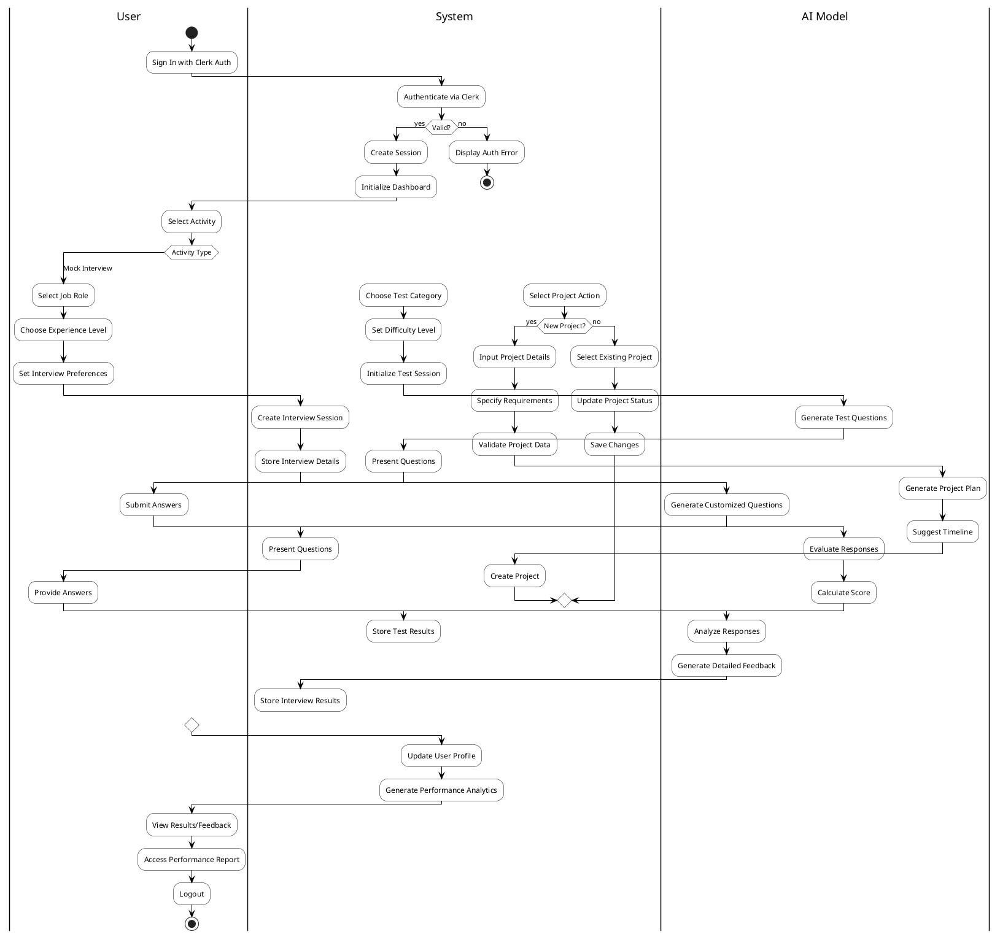

# Activity Diagram

## Activity Flow Description
### User Flow
- Sign in using Clerk Authentication
- Choose activity type (Mock Interview/Aptitude Test/Project)
- Provide necessary details and preferences
- Complete assigned tasks
- View results and performance analytics

### System Flow
- Handle Clerk authentication
- Manage user sessions
- Process and validate user inputs
- Store results in Neon PostgreSQL
- Generate performance analytics

### AI Model Flow
- Generate customized questions for interviews and tests
- Process and analyze user responses
- Provide detailed feedback and evaluations
- Generate project plans and timelines
- Calculate performance metrics