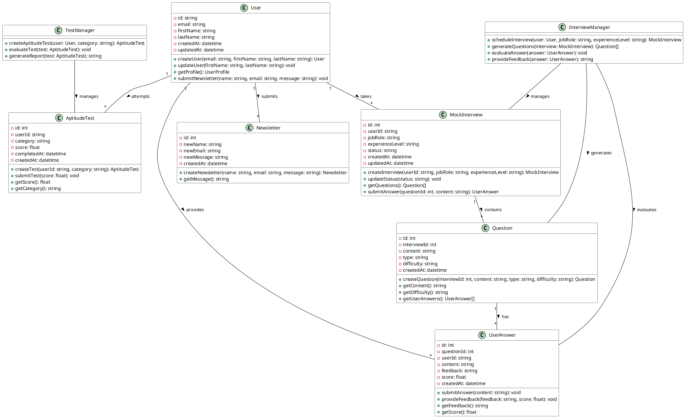

# Class Diagram

## Class Details

### User
Represents the system user with authentication and profile information.
- Manages user profile data
- Handles newsletter submissions
- Links to interviews, answers, and tests

### Newsletter
Handles newsletter subscriptions and contact form data.
- Stores contact form submissions
- Manages message content

### MockInterview
Manages interview sessions and their lifecycle.
- Tracks interview progress
- Contains questions
- Manages user responses

### Question
Represents interview questions with their properties.
- Stores question content and metadata
- Links to user answers
- Manages difficulty levels

### UserAnswer
Handles user responses to interview questions.
- Stores answer content
- Manages feedback and scoring
- Links to questions and users

### AptitudeTest
Manages aptitude test sessions and results.
- Tracks test progress
- Stores scores
- Manages test categories

### InterviewManager
Service class that handles interview-related operations.
- Schedules interviews
- Generates questions
- Evaluates answers
- Provides feedback

### TestManager
Service class for managing aptitude tests.
- Creates tests
- Evaluates responses
- Generates reports

## Relationships

### User Relationships
- One User can submit multiple Newsletters
- One User can take multiple MockInterviews
- One User can provide multiple UserAnswers
- One User can attempt multiple AptitudeTests

### Interview Relationships
- One MockInterview contains multiple Questions
- One Question can have multiple UserAnswers
- InterviewManager manages MockInterviews, Questions, and UserAnswers

### Test Relationships
- TestManager manages AptitudeTests
- Each AptitudeTest belongs to one User