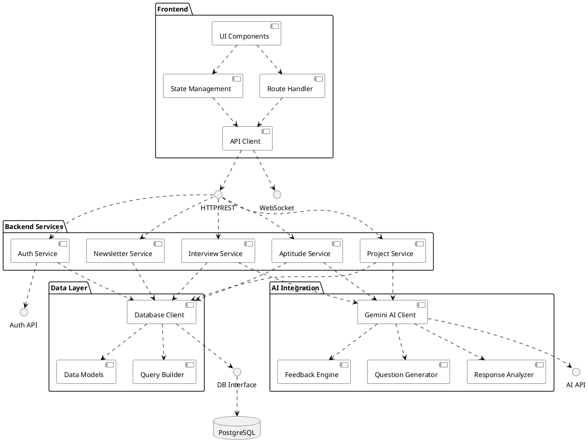

# Component Diagram

## Component Details

### Frontend Components
- UI Components: Reusable UI elements and page layouts
- State Management: Handles application state and data flow
- Route Handler: Manages client-side routing
- API Client: Handles communication with backend services

### Backend Services
- Auth Service: Manages user authentication and session handling
- Interview Service: Handles mock interview sessions and feedback
- Project Service: Manages project generation and tracking
- Aptitude Service: Handles aptitude test creation and evaluation
- Newsletter Service: Manages newsletter subscriptions

### AI Integration
- Gemini AI Client: Main interface for AI operations
- Question Generator: Creates interview questions and tests
- Response Analyzer: Evaluates user responses
- Feedback Engine: Generates detailed feedback and suggestions

### Data Layer
- Database Client: Handles database operations
- Data Models: Defines data structure and relationships
- Query Builder: Constructs and optimizes database queries