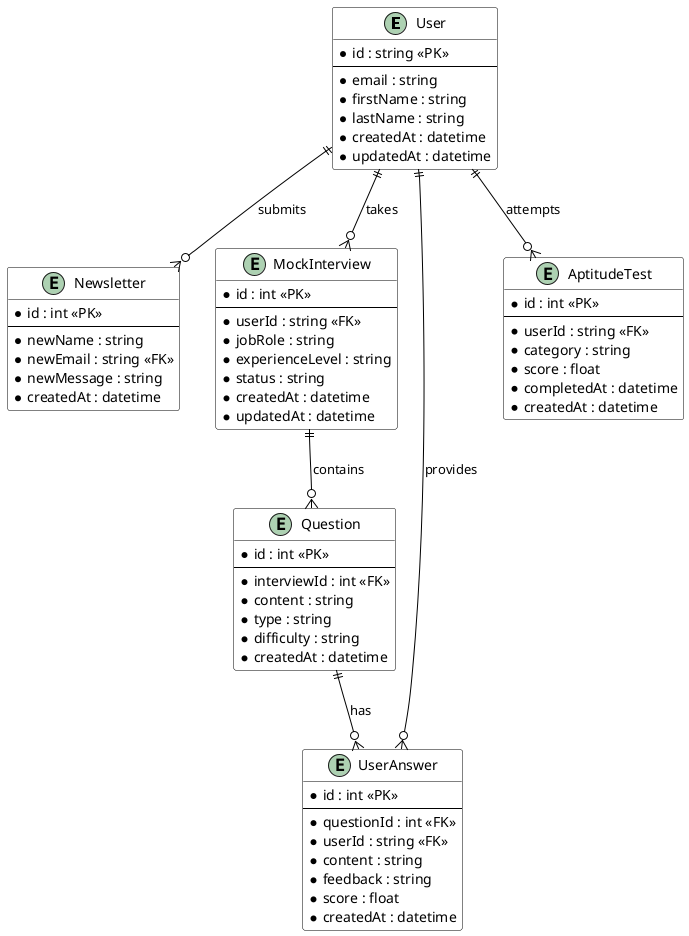

# Entity Relationship Diagram

## Relationships

### User - Newsletter (One-to-Many)
- One User can submit multiple Newsletter entries
- Each Newsletter entry is associated with one User
- The relationship is established through the User's email address

### User - MockInterview (One-to-Many)
- One User can take multiple Mock Interviews
- Each Mock Interview belongs to one User
- Connected through userId foreign key

### MockInterview - Question (One-to-Many)
- One Mock Interview contains multiple Questions
- Each Question belongs to one Mock Interview
- Connected through interviewId foreign key

### Question - UserAnswer (One-to-Many)
- One Question can have multiple UserAnswers
- Each UserAnswer is for one specific Question
- Connected through questionId foreign key

### User - UserAnswer (One-to-Many)
- One User can provide multiple UserAnswers
- Each UserAnswer is given by one User
- Connected through userId foreign key

### User - AptitudeTest (One-to-Many)
- One User can attempt multiple AptitudeTests
- Each AptitudeTest belongs to one User
- Connected through userId foreign key

## Entity Details

### User (Clerk Authentication)
- Managed by Clerk authentication system
- Contains core user information and authentication details
- Primary identifier is the unique Clerk user ID
- Email serves as a natural identifier for linking with other entities

### Newsletter
- Stores newsletter subscription and contact form submissions
- Links to User through email address
- Includes message content and timestamp
- Maintains user's name as entered in the form

### MockInterview
- Represents an interview session
- Tracks interview context (job role, experience level)
- Maintains interview status and timestamps
- Links to User through userId

### Question
- Stores interview questions
- Categorized by type and difficulty
- Associated with specific MockInterview sessions
- Includes creation timestamp

### UserAnswer
- Records user responses to questions
- Stores AI-generated feedback and scoring
- Links to both User and Question
- Includes performance metrics

### AptitudeTest
- Tracks aptitude test attempts
- Stores test category and overall score
- Records completion and creation timestamps
- Links to User through userId