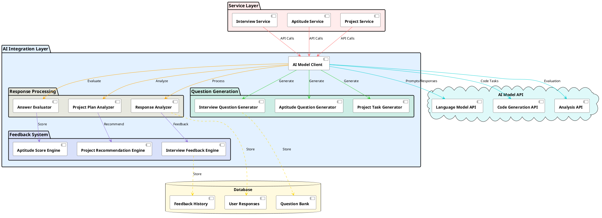

# AI Model Architecture

## Architecture Overview

### AI Integration Layer

#### AI Model Client
- Core interface for interacting with AI Model API
- Handles prompt engineering and response processing
- Manages API rate limiting and error handling

#### Question Generation
- **Interview Question Generator**: Creates personalized interview questions based on job role and experience level
- **Aptitude Question Generator**: Generates domain-specific aptitude questions
- **Project Task Generator**: Creates project tasks and requirements based on user input

#### Response Processing
- **Response Analyzer**: Evaluates interview answers for completeness and accuracy
- **Answer Evaluator**: Assesses aptitude test responses and calculates scores
- **Project Plan Analyzer**: Reviews and validates project plans and implementations

#### Feedback System
- **Interview Feedback Engine**: Provides detailed feedback on interview responses
- **Aptitude Score Engine**: Generates performance reports and improvement suggestions
- **Project Recommendation Engine**: Offers project enhancement recommendations

### Service Layer Integration
- Services communicate with AI Model Client through structured prompts
- Responses are processed and transformed into appropriate formats
- Results are stored in the database for future reference

### External API Integration
- **Language Model API**: Handles natural language processing tasks
- **Code Generation API**: Manages technical and coding-related tasks
- **Analysis API**: Performs deep analysis of user responses

### Data Management
- **Question Bank**: Stores generated questions and their metadata
- **User Responses**: Records user answers and interactions
- **Feedback History**: Maintains historical feedback and recommendations