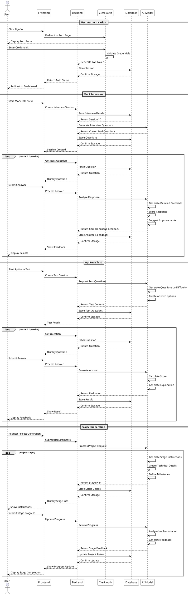

# Sequence Diagram

## Sequence Details

### Authentication Flow
- User initiates sign-in process
- Clerk Auth handles authentication
- Backend validates and stores session
- Frontend redirects to dashboard

### Mock Interview Process
- User starts interview session
- AI Model generates customized questions
- System manages question flow
- AI Model provides comprehensive answer analysis
- Results and feedback are stored and displayed

### Aptitude Test Process
- User initiates test session
- AI Model generates questions and options
- System manages test flow
- AI Model evaluates answers and provides explanations
- Results and feedback are stored and displayed

### Project Generation Process
- User submits project requirements
- AI Model breaks down into stages
- Each stage includes detailed instructions
- System tracks progress and provides feedback
- AI Model reviews implementation and suggests improvements