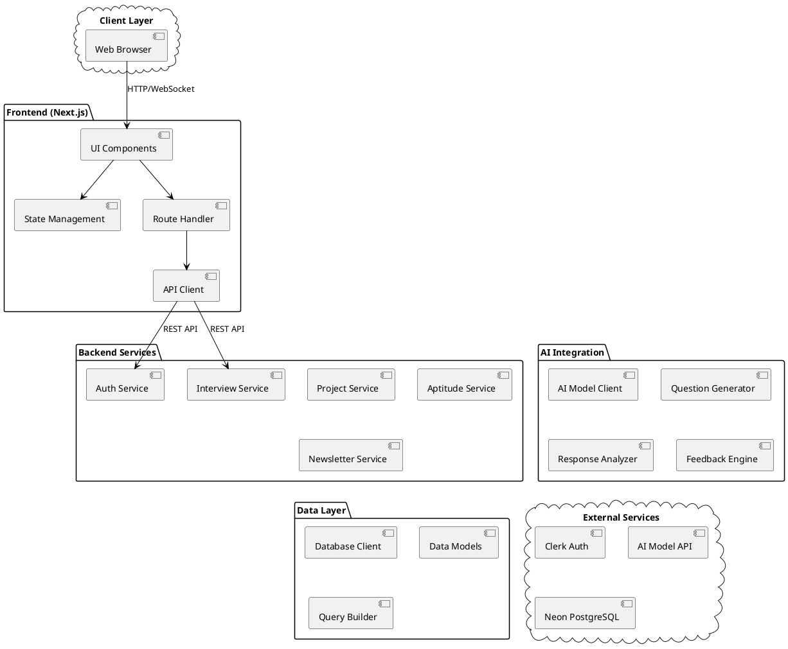

# System Architecture

## Architecture Overview
### AI Integration
- AI Model Client: Core AI service integration
- Question Generator: Generates interview/test questions
- Response Analyzer: Analyzes user responses
- Feedback Engine: Provides AI-powered feedback