# Use Case Diagram

```plantuml
@startuml

skinparam usecase {
    BackgroundColor White
    BorderColor Black
    ArrowColor Black
}

actor "User" as user
actor "Admin" as admin

rectangle "Proxima AI System" {
    ' Authentication Use Cases
    usecase "Register Account" as register
    usecase "Sign In" as signin
    usecase "Manage Profile" as profile

    ' Interview Use Cases
    usecase "Take Mock Interview" as interview
    usecase "Answer Questions" as answer
    usecase "Receive Feedback" as feedback
    usecase "View Interview History" as history

    ' Aptitude Test Use Cases
    usecase "Take Aptitude Test" as test
    usecase "View Test Results" as results
    usecase "Get Performance Report" as report

    ' Project Use Cases
    usecase "View Projects" as viewProjects
    usecase "Create Project" as createProject
    usecase "Update Project Status" as updateProject
    usecase "Delete Project" as deleteProject

    ' Newsletter Use Cases
    usecase "Subscribe Newsletter" as subscribe
    usecase "Submit Contact Form" as contact

    ' Admin Use Cases
    usecase "Manage Questions" as manageQuestions
    usecase "Monitor User Progress" as monitorProgress
    usecase "Generate Reports" as generateReports
    usecase "Manage Projects" as manageProjects
}

' User Relationships
user --> register
user --> signin
user --> profile
user --> interview
user --> answer
user --> test
user --> results
user --> viewProjects
user --> createProject
user --> updateProject
user --> deleteProject
user --> subscribe
user --> contact

' System Relationships
interview ..> answer : <<include>>
answer ..> feedback : <<include>>
test ..> results : <<include>>
results ..> report : <<include>>

' Admin Relationships
admin --> manageQuestions
admin --> monitorProgress
admin --> generateReports
admin --> manageProjects

@enduml
```

## Use Case Details

### User Use Cases

#### Authentication
- **Register Account**: New users can create an account
- **Sign In**: Users can authenticate into the system
- **Manage Profile**: Users can update their profile information

#### Interview Preparation
- **Take Mock Interview**: Users can start mock interview sessions
- **Answer Questions**: Users can respond to interview questions
- **Receive Feedback**: Users get AI-powered feedback on their answers
- **View Interview History**: Users can review past interviews

#### Aptitude Testing
- **Take Aptitude Test**: Users can attempt aptitude tests
- **View Test Results**: Users can see their test scores
- **Get Performance Report**: Users can access detailed performance analysis

#### Projects
- **View Projects**: Users can browse available projects
- **Create Project**: Users can create new projects
- **Update Project Status**: Users can update their project progress
- **Delete Project**: Users can remove their projects

#### Communication
- **Subscribe Newsletter**: Users can subscribe to newsletters
- **Submit Contact Form**: Users can send messages through contact form

### Admin Use Cases

#### System Management
- **Manage Questions**: Admins can manage interview questions database
- **Monitor User Progress**: Admins can track user performance
- **Generate Reports**: Admins can create system-wide reports
- **Manage Projects**: Admins can oversee and manage all projects